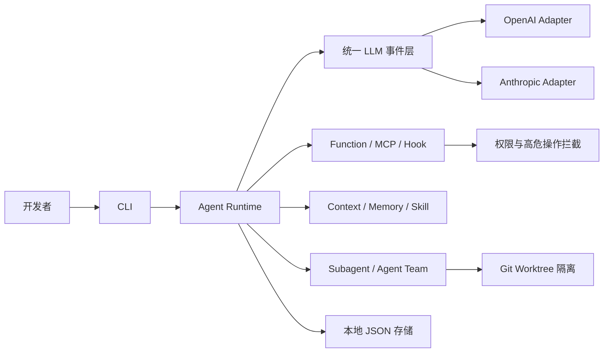

# Hammer Code

> 面向个人开发者的轻量级 CLI Coding Agent。

Hammer Code 是一个正在设计中的 Coding Agent。它借鉴 Claude Code 的交互方式与能力边界，但更强调轻量、透明、可控：尽量减少框架依赖，并自主实现 Agent Loop、流式通信、工具调用、权限控制、上下文管理和多 Agent 协作等核心机制。

> [!IMPORTANT]
> 项目目前处于设计阶段，尚未开始编码，暂时没有可安装或可运行的版本。

## 为什么做 Hammer Code

许多 Agent 框架能够快速拼装功能，但也可能隐藏通信、调度、上下文和工具执行的关键细节。Hammer Code 希望在保持工程规模轻量的同时，让核心行为可以被理解、修改和验证。

- **轻量**：避免为了少量能力引入庞大框架或重量级中间件。
- **透明**：核心执行链路由项目自身掌控，降低隐式行为。
- **协议中立**：同时适配 OpenAI 与 Anthropic 协议，对上游暴露统一事件模型。
- **本地优先**：状态和长期数据计划使用本地 JSON 文件保存。
- **面向协作**：支持 Subagent、Agent Team 与 Git worktree 工作区隔离。
- **安全兜底**：在工具执行层设计权限管理与高危命令拦截。

## 架构方向

OpenAI 和 Anthropic 的协议差异由下游适配器处理，包括请求、响应和流式事件转换。Agent Runtime 只消费统一的上游事件，避免核心循环与特定模型供应商耦合。

运行时计划以单一 Python 进程为主，通过 `asyncio.Task` 驱动通信、工具调用、子 Agent 和其他异步任务。不同协程采用协作式调度，共享进程内资源。

## 计划能力

- [ ] CLI 交互入口
- [ ] OpenAI 与 Anthropic 通信协议适配
- [ ] 统一流式事件模型
- [ ] Prompt 组织与 Agent Loop
- [ ] Function Calling 与工具系统
- [ ] MCP 支持
- [ ] Hook 机制
- [ ] 权限管理与高危命令拦截
- [ ] Context 上下文窗口管理
- [ ] Memory 提取与本地持久化
- [ ] Skill 加载与执行
- [ ] 基于用户交互反馈的 Skill 演进
- [ ] Subagent
- [ ] Git worktree 工作区隔离
- [ ] Agent Team 多 Agent 协调

## 设计原则

### 掌控核心链路

通信协议、流式适配、Agent Loop、工具调用、Hook 和 Subagent 等关键机制优先自主实现。引入依赖并非被禁止，但依赖必须带来明确收益，且不应模糊核心执行语义。

### 保持运行时轻量

项目可以直接引入实用的 Python 依赖，但会尽量避免 RocketMQ 一类需要独立部署和运维的重量级中间件。新增复杂基础设施应由真实需求驱动。

### 隔离供应商协议

模型供应商协议只存在于适配器边界。统一事件模型、Agent Loop、工具系统和上下文管理不应感知具体供应商的流式数据格式。

### 安全是执行层能力

权限判断不能只依赖 Prompt。工具执行链路需要提供明确的权限边界，并对高危命令进行程序化拦截和兜底。

### 多 Agent 修改相互隔离

并发写代码的子 Agent 使用 Git worktree 隔离工作区。权限和上下文可以按任务选择完整继承、压缩继承或独立创建，具体策略将在实现阶段设计。

## 当前技术基线

| 项目 | 当前结论 |
| --- | --- |
| 产品形态 | CLI |
| 主要用户 | 个人开发者 |
| 开发语言 | Python |
| 当前设计环境 | Python 3.11.4 / Windows |
| 并发模型 | 单进程、`asyncio.Task`、协作式调度 |
| LLM 协议 | OpenAI、Anthropic |
| 持久化 | 本地 JSON 文件 |
| 包管理器 | 尚未选择 |
| 项目状态 | 设计阶段 |

Python 3.11.4 只是当前设计环境，并非已经承诺的最低兼容版本。仓库结构、包管理器、测试工具和分发方式将在工程初始化阶段确定。

## 路线图

1. 确定仓库结构、包管理器、CLI 入口和基础工程规范。
2. 建立统一事件模型，并完成 OpenAI、Anthropic 流式协议适配。
3. 实现单 Agent Loop、Prompt、工具调用、Hook 和权限控制。
4. 实现 Context、Memory、Skill 与本地 JSON 持久化。
5. 实现 Subagent、worktree 隔离和异步任务管理。
6. 扩展 Agent Team 协调与基于反馈的 Skill 演进能力。

路线图描述的是当前方向，不代表稳定 API 或交付承诺，后续可能随设计验证调整。

## 开始使用

Hammer Code 尚无可运行版本，目前无需安装。首个工程骨架建立后，本节将补充环境准备、安装、启动、测试和构建命令。

如果你对轻量 Coding Agent、统一 LLM 流式协议、上下文管理或多 Agent 工作区隔离感兴趣，欢迎通过 Issue 参与早期设计讨论。

## 项目关系

Hammer Code 是独立项目，与 Anthropic、OpenAI 或 Claude Code 官方没有隶属关系。文中提及的产品和协议名称仅用于说明设计目标与兼容范围。

## License

许可证尚未确定。在正式选择并添加许可证文件前，请勿假定本仓库已经授予开源使用许可。
